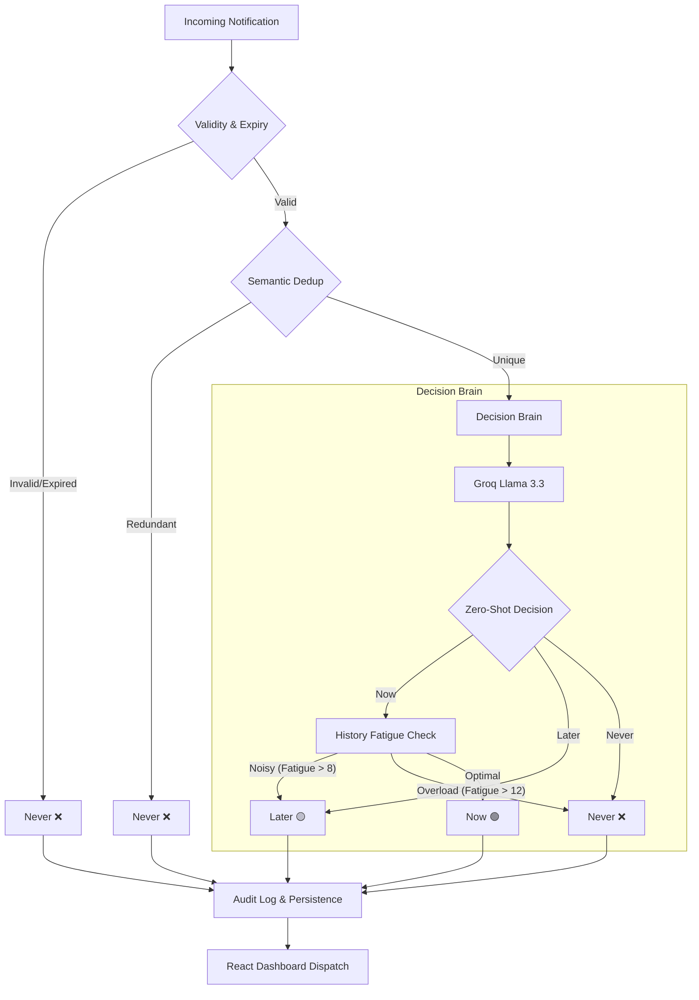

# Notification Prioritization Engine - Architecture

This document outlines the AI-native architecture designed for Cyepro Solutions.

## System Workflow

## Core Components

### 1. Decision Engine (Python/FastAPI)
The central nervous system. It orchestrates the 9-stage pipeline, coordinating between the LLM classifier and local heuristic checks.

### 2. Semantic Deduplicator (Sentence-Transformers + FAISS)
Uses vector embeddings to detect "near-duplicates". If a user receives two messages that mean the same thing (even if worded differently), the engine suppresses the second as redundant noise.

### 3. AI Classifier (Groq Cloud + Llama 3)
The primary intelligence layer. It analyzes the *intent* and *urgency* of the message content without requiring hard-coded regex or keywords.

### 4. Exponential Decay Fatigue Model
Instead of simple counters, it uses a time-decaying score ($Score = \sum e^{-\lambda \Delta t}$). This mimics human attention span—recent notifications impact fatigue more than ones from yesterday.

### 5. XAI Audit Service
Every decision results in a human-readable explanation generated by the LLM, ensuring transparency and "why" behind every suppression.
