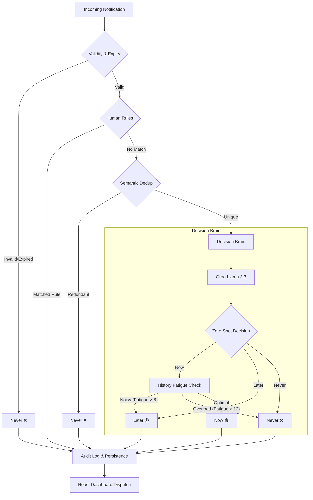

# Notification Prioritization Engine - Architecture

This document provides a deep dive into the AI-native architecture of the CyePro Notification Prioritization Engine.

## The 9-Stage Priority Pipeline

The system processes every notification through a multi-stage pipeline to ensure low-latency, high-accuracy prioritization even under heavy load.

| Stage | Name | Description | Logic / Technology |
| :--- | :--- | :--- | :--- |
| 1 | **Ingestion & Pre-logging** | Immediate capture of the event for auditability. | SQLite Audit Log |
| 2 | **Validation & Cleanup** | Standardizing fields and checking for malformed data. | Pydantic Models |
| 3 | **Expiry Check** | Filtering out notifications that are already past their `expires_at` window. | Temporal Logic |
| 4 | **Configurable Rules** | Dynamic suppression or prioritisation based on human-defined conditions. | Rules Service (SQLite) |
| 5 | **Exact Deduplication** | Rapid suppression based on `dedupe_key` or identical hashes. | Hash Comparison |
| 6 | **Semantic Deduplication** | Detecting unique but redundant messages (e.g., "The server is down" vs "System outage detected"). | Sentence-Transformers + FAISS |
| 7 | **Context Retrieval** | Fetching user history and current fatigue scores. | SQLite History Service |
| 8 | **AI Decision Brain** | Zero-shot classification into NOW, LATER, or NEVER. | Groq / Llama 3.3 (70B) |
| 9 | **Fatigue Post-Processing** | Adjusting AI decisions based on user's real-time cognitive load. | Exponential Decay Model |
| 10 | **Final Dispatch & Audit** | Persistent logging of the final decision and dispatch to the dashboard. | WebSocket / REST |

## Core Logic & Brain Components

### 1. Semantic Deduplicator (Sentence-Transformers + FAISS)
To handle cases where **duplicate keys are missing or unreliable**, we use vector embeddings (`all-MiniLM-L6-v2`) to map message meanings.
- **Thresholding**: We use a Cosine Similarity/L2 distance threshold (default: 0.6).
- **Suppression**: If a new message is semantically identical to one sent in the last hour, it is suppressed to prevent interruption.

### 2. AI Classifier (Groq Cloud + Llama 3.3)
The engine doesn't rely on fragile regex rules. It uses an LLM to understand the *urgency* of the text.
- **Explainability**: The AI generates a `reason` field for every decision, fulfilling the **explainability/auditability** constraint.
- **Latency Optimization**: We use Groq's Llama-3.3-70b-versatile with a strict 2-second timeout and fallback logic.

### 3. Exponential Decay Fatigue Model
To handle **noisy periods** and prevent **alert fatigue**, we track how many "NOW" notifications a user has received.
- **Formula**: $Score = \sum e^{-\lambda \Delta t}$
- **Logic**:
  - `Score > 8`: Non-critical notifications are downgraded from "NOW" to "LATER".
  - `Score > 12`: Only system-critical/security alerts (Priority: Critical) are allowed through; others are suppressed.

### 4. Safety & Reliability (No Silent Loss)
Every event, even those suppressed as "NEVER", is logged in the **Audit Service**. Users can review suppressed messages in the "Audit Feed", ensuring no important notification is **silently lost**.

## System Flowchart

